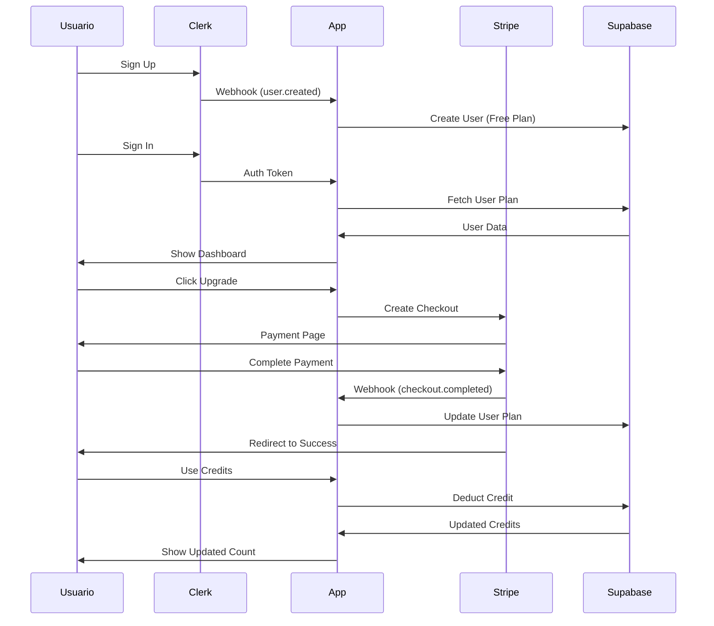

# Flujo Completo de Usuarios y Pagos

## 📋 Tabla de Contenidos
1. [Registro de Usuario](#registro-de-usuario)
2. [Inicio de Sesión](#inicio-de-sesión)
3. [Compra de Plan](#compra-de-plan)
4. [Sistema de Créditos](#sistema-de-créditos)
5. [Webhooks](#webhooks)

---

## 1. Registro de Usuario

### Flujo Normal
```
Usuario → Clerk Sign Up → Clerk Webhook → Supabase
```

**Pasos:**
1. Usuario se registra en Clerk con email/password o Google
2. Clerk crea la cuenta y genera un `userId`
3. Clerk envía webhook `user.created` a `/api/auth/webhook`
4. El webhook:
   - Verifica si el email ya existe en Supabase
   - Si NO existe: Crea nuevo usuario con plan FREE
   - Si existe: Ignora (usuario ya registrado)

**Datos iniciales del usuario:**
```typescript
{
  id: "user_xxxxx",           // De Clerk
  email: "user@example.com",   // De Clerk
  name: "John Doe",            // De Clerk (si disponible)
  plan: "free",                // Por defecto
  credits_remaining: 1,        // 1 crédito gratis
  credits_total: 1,
  stripe_customer_id: null,
  purchased_at: null,
  expires_at: null,
  created_at: "2025-10-16..."
}
```

---

## 2. Inicio de Sesión

### Flujo de Autenticación
```
Usuario → Clerk Sign In → App Dashboard → Fetch User Plan
```

**Pasos:**
1. Usuario inicia sesión con Clerk
2. App carga el dashboard
3. Hook `useUserPlan()` llama a `/api/user/plan`
4. API `/api/user/plan`:
   - Busca usuario por `userId` en Supabase
   - Si NO existe por ID:
     - Obtiene email de Clerk
     - Busca por email en Supabase
     - Si existe → Retorna datos existentes
     - Si NO existe → Crea usuario nuevo
   - Retorna plan, créditos, features

**Manejo de Emails Duplicados:**
```typescript
// Escenario: Usuario tiene cuenta existente pero userId diferente
1. Buscar por userId → No encontrado
2. Obtener email de Clerk → "user@example.com"
3. Buscar por email → ¡Encontrado!
4. Retornar datos del usuario existente
5. ✅ Usuario puede acceder a su cuenta
```

---

## 3. Compra de Plan

### Flujo de Pago con Stripe

```
Usuario → Selecciona Plan → Stripe Checkout → Webhook → Supabase
```

**Pasos Detallados:**

#### 3.1. Usuario Selecciona Plan
- Usuario va a `/dashboard/plans` o `/dashboard/upgrade`
- Click en "Upgrade to Pro" o "Upgrade to Ultimate"
- Frontend llama a `/api/stripe/checkout`

#### 3.2. Crear Checkout Session
```typescript
POST /api/stripe/checkout
Body: { plan: "pro" | "ultimate" }

// API crea sesión de Stripe con metadata:
{
  userId: "user_xxxxx",
  plan: "pro",
  credits: "10",
  durationDays: "90" // Solo para Ultimate
}
```

#### 3.3. Usuario Paga en Stripe
- Redirección a Stripe Checkout
- Usuario completa el pago
- Stripe redirige a `/success?session_id=xxx`

#### 3.4. Stripe Envía Webhook
```
Stripe → POST /api/stripe/webhook
Event: checkout.session.completed
```

**El webhook hace:**

1. **Verifica el evento** con firma de Stripe
2. **Obtiene metadata** de la sesión:
   - `userId`
   - `plan` (pro/ultimate)
   - `credits`
3. **Consulta usuario actual** en Supabase
4. **Calcula créditos a agregar:**
   ```typescript
   Free → Pro: 10 créditos
   Free → Ultimate: 999 créditos
   Pro → Ultimate: 999 créditos
   ```
5. **Obtiene datos del cliente** de Stripe:
   - Customer ID
   - Nombre (si está disponible)
6. **Calcula fechas:**
   ```typescript
   purchased_at: new Date()
   expires_at: plan === 'ultimate'
     ? new Date(+90 días)
     : null
   ```
7. **Actualiza usuario en Supabase:**
   ```typescript
   {
     plan: "pro" | "ultimate",
     credits_remaining: 10 | 999,
     credits_total: 10 | 999,
     purchased_at: "2025-10-16...",
     expires_at: "2026-01-14..." | null,
     stripe_customer_id: "cus_xxxxx",
     name: "John Doe" // Si disponible
   }
   ```

#### 3.5. Usuario Ve Confirmación
- Página `/success` muestra éxito
- Dashboard actualiza automáticamente con nuevo plan

---

## 4. Sistema de Créditos

### Planes y Créditos

| Plan | Precio | Créditos | Expira | Características |
|------|--------|----------|--------|-----------------|
| **Free** | $0 | 1 | Nunca | 1 CV básico |
| **Pro** | $19 | 10 | Nunca | 10 CVs + Cover Letters |
| **Ultimate** | $49 | 999 (ilimitado) | 90 días | CVs ilimitados + Extras |

### Uso de Créditos

**Cada acción que consume crédito:**
- ✅ Generar CV con IA
- ✅ Exportar CV a PDF
- ✅ Generar Cover Letter

**NO consume crédito:**
- ❌ Editar CV existente
- ❌ Ver CVs guardados
- ❌ Cambiar template
- ❌ Preview en tiempo real

### Validación de Créditos
```typescript
// Antes de cualquier acción que consume crédito:
if (user.plan !== 'ultimate' && user.credits_remaining < 1) {
  return error('No credits remaining');
}

// Después de la acción:
if (user.plan !== 'ultimate') {
  await deductCredit(userId);
}
```

---

## 5. Webhooks

### Webhook de Clerk (`/api/auth/webhook`)

**Eventos manejados:**
- `user.created` → Crea usuario en Supabase
- `user.updated` → Actualiza email/nombre
- `user.deleted` → Elimina usuario (CASCADE elimina CVs)

**Configuración:**
```
URL: https://yourdomain.com/api/auth/webhook
Secret: CLERK_WEBHOOK_SECRET
```

### Webhook de Stripe (`/api/stripe/webhook`)

**Eventos manejados:**
- `checkout.session.completed` → Actualiza plan del usuario

**Configuración:**
```
URL: https://yourdomain.com/api/stripe/webhook
Secret: STRIPE_WEBHOOK_SECRET
Events: checkout.session.completed
```

**Datos actualizados:**
```typescript
{
  plan: string,              // "pro" | "ultimate"
  credits_remaining: number, // 10 | 999
  credits_total: number,     // 10 | 999
  purchased_at: string,      // ISO timestamp
  expires_at: string | null, // ISO timestamp o null
  stripe_customer_id: string,// "cus_xxxxx"
  name: string | null        // De Stripe si disponible
}
```

---

## 🔐 Variables de Entorno Requeridas

### Clerk
```env
NEXT_PUBLIC_CLERK_PUBLISHABLE_KEY=pk_test_xxxxx
CLERK_SECRET_KEY=sk_test_xxxxx
CLERK_WEBHOOK_SECRET=whsec_xxxxx
```

### Stripe
```env
NEXT_PUBLIC_STRIPE_PUBLISHABLE_KEY=pk_test_xxxxx
STRIPE_SECRET_KEY=sk_test_xxxxx
STRIPE_WEBHOOK_SECRET=whsec_xxxxx
```

### Supabase
```env
NEXT_PUBLIC_SUPABASE_URL=https://xxxxx.supabase.co
NEXT_PUBLIC_SUPABASE_ANON_KEY=eyJxxx...
SUPABASE_SERVICE_KEY=eyJxxx...
```

---

## 🧪 Testing

### Test Webhook Localmente

**Clerk:**
```bash
clerk listen --forward-to localhost:3000/api/auth/webhook
```

**Stripe:**
```bash
stripe listen --forward-to localhost:3000/api/stripe/webhook
```

### Test Cards de Stripe
```
Success: 4242 4242 4242 4242
Decline: 4000 0000 0000 0002
```

---

## 📊 Flujo de Datos Completo



---

**Última actualización:** 2025-10-16
